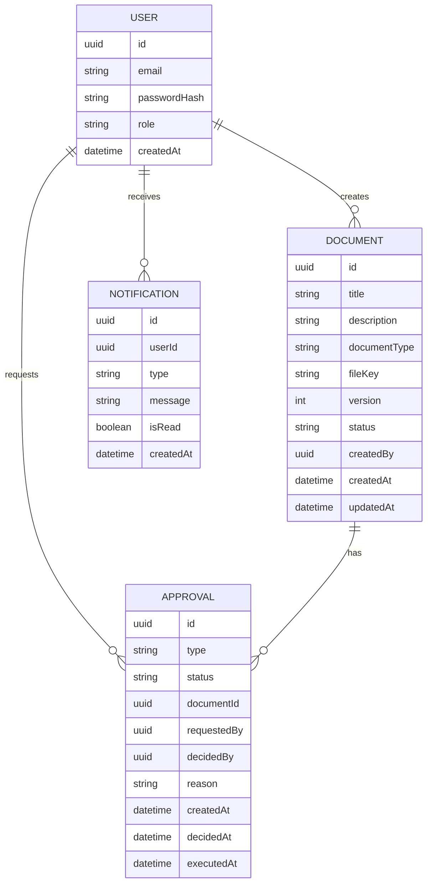

# ERD (Entity Relationship Diagram)

Below is a minimal ERD to explain core data relationships.  
(Your implementation may add fields like `tenantId`, `department`, `audit`, `outbox`, etc.)

---

## Indexing Recommendations (PostgreSQL)

- `Document(createdBy, createdAt DESC)` → list
- `Document(title)` + trigram index (optional) → search
- `Approval(status, createdAt DESC)` → admin queue
- `Approval(documentId, status)` → enforce single pending per document
- `Notification(userId, createdAt DESC)` → notification feed
